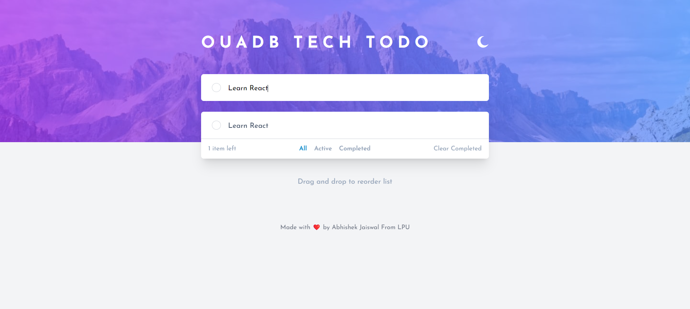
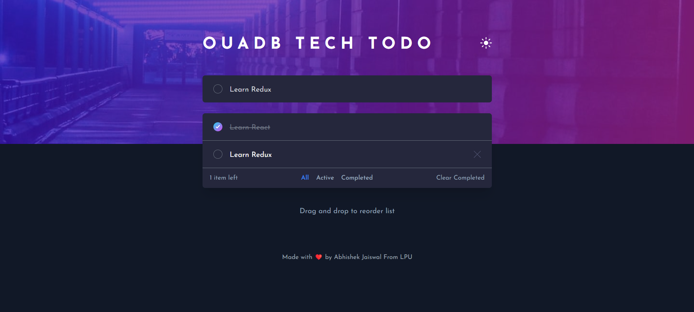
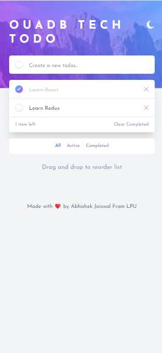
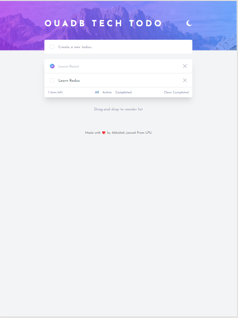

# React Todo App
A simple todo application built with React with redux, featuring drag-and-drop functionality, filter options, and a responsive design. Users can create, toggle, and delete todo items. Styled with Tailwind CSS and uses localStorage for persistent storage.
This project was created as part of an internship for __Quadb Tech__.

## Features
- Create, toggle, and delete todo items
- Drag-and-drop functionality for reordering todos
- Filter options for displaying active, completed, or all todos
- Responsive design for mobile and desktop

## Screenshots
### Modes 
#### Light Mode

#### Dark Mode

### Responsiveness
#### Mobile View

#### Tablet View


## Installation

#### Follow these steps to run the application locally:

1- Clone this repository to your local machine:
```
git clone https://github.com/your-username/react-todo-app.git
```

2- Navigate to the project directory:
```
cd react-todo-app
```

3- Install dependencies using npm or yarn:
```
npm install
# or
yarn install
```

4- Start the development server:
```
npm run dev
or
npm start
```

5- Open your browser and navigate to http://localhost:3000 to view the application.

## Technologies Used

- React
- Redux
- Tailwind CSS
- localStorage

## Contributing

Contributions are welcome! Feel free to open an issue or submit a pull request.

## License
This project is licensed under the MIT License - see the LICENSE file for details.

## Author
Abhishek Jaiswal 
